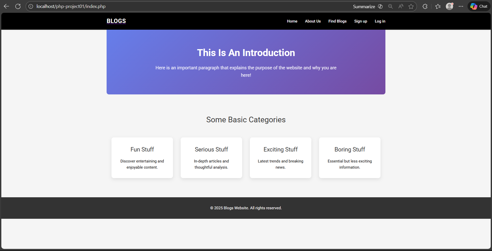
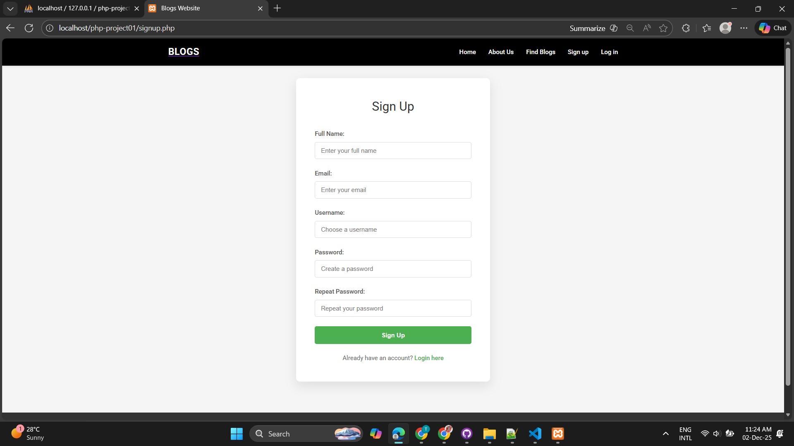
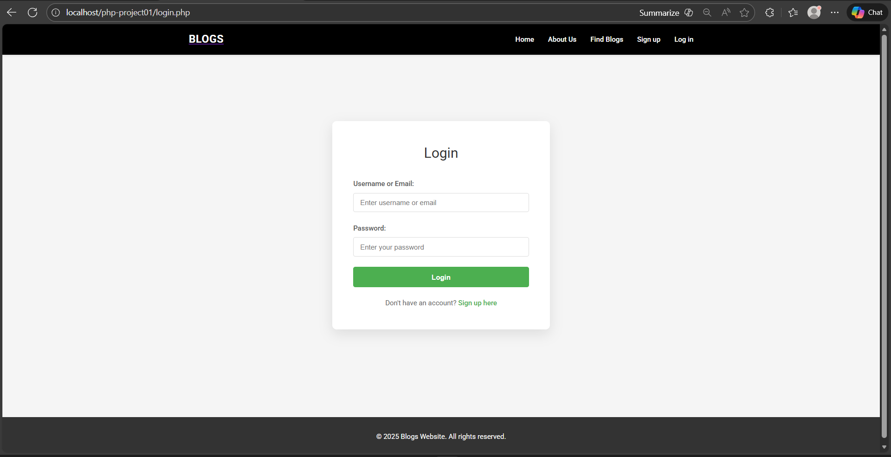
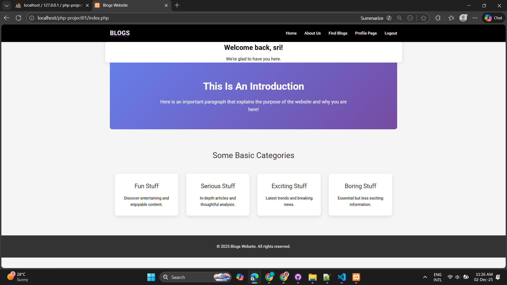

# 🔐 **PHP Login System with Session Management**

## 🚀 **Project Overview**

A **complete, secure, and professional** PHP login system built from scratch. This system features user registration, secure authentication, session management, and dynamic navigation. Perfect for learning PHP fundamentals and web security practices.

---

## ✨ **Features**

| Feature                   | Status      | Description                       |
| ------------------------- | ----------- | --------------------------------- |
| ✅ **User Registration**  | Complete    | Secure signup with validation     |
| ✅ **User Login**         | Complete    | Password hashing & authentication |
| ✅ **Session Management** | Complete    | Persistent login state            |
| ✅ **Dynamic Navigation** | Complete    | Menu changes when logged in       |
| ⏳ **Profile Page**       | In Progress | User-specific content             |
| ✅ **Logout System**      | Complete    | Secure session destruction        |
| ✅ **Responsive Design**  | Complete    | Works on all devices              |
| ✅ **Error Handling**     | Complete    | User-friendly messages            |

---

## 🛠️ **Technology Stack**

- **Frontend:** HTML5, CSS3, JavaScript
- **Backend:** PHP 7.4+
- **Database:** MySQL
- **Security:** `password_hash()`, Prepared Statements
- **Session:** PHP Native Sessions
- **Styling:** Custom CSS with Roboto Font
- **Server:** XAMPP (Local Development)

---

## 📦 **Installation Guide**

### **Prerequisites**

Make sure you have these installed:

- ☑️ **XAMPP** (Apache + MySQL + PHP)
- ☑️ **Git** (Optional, for version control)
- ☑️ **Web Browser** (Chrome/Firefox)

### **Step 1: Setup XAMPP**

1. **Start XAMPP Control Panel**
2. **Start Apache** and **MySQL** services
3. **Verify** by visiting: `http://localhost`

### **Step 2: Database Setup**

1. Open **phpMyAdmin** (`http://localhost/phpmyadmin`)
2. **Important:** Your database name should be: **`php-project`**
3. Run this SQL in your database:

```sql
CREATE TABLE users (
    usersId INT(11) PRIMARY KEY AUTO_INCREMENT,
    usersName VARCHAR(128) NOT NULL,
    usersEmail VARCHAR(128) NOT NULL,
    usersUid VARCHAR(128) NOT NULL,
    usersPwd VARCHAR(128) NOT NULL,
    created_at TIMESTAMP DEFAULT CURRENT_TIMESTAMP
);
```

### **Step 3: Project Setup**

1. **Your project folder is at:** `C:\xampp\htdocs\php-project01`
2. **Configure database** in `includes/dbh.inc.php`:

```php
<?php
$dbServerName = "localhost";
$dbUserName = "root";      // Default XAMPP username
$dbPassword = "";          // Default XAMPP password (empty)
$dbName = "php-project";   // YOUR DATABASE NAME
?>
```

### **Step 4: Run the Project**

1. Open browser
2. Visit: `http://localhost/php-project01`
3. **🎉 System is ready!**

---

## 📱 **How to Use**

### **👤 For New Users:**

1. **Click** "Sign up" in navigation
2. **Fill** the registration form:
   - Username
   - Email address
   - Password
3. **Submit** and you'll be automatically logged in!

### **🔑 For Existing Users:**

1. **Click** "Log in" in navigation
2. **Enter** your credentials
3. **Enjoy** personalized welcome message!

### **👋 After Login:**

- ✅ Navigation changes to "Profile Page" and "Logout"
- ✅ Welcome message shows your username
- ✅ Access to protected pages
- ✅ Session maintained across pages

### **🚪 Logging Out:**

1. **Click** "Logout" in navigation
2. **Session** is securely destroyed
3. **Redirected** to homepage

---

## 📸 **Screenshots**

### **🏠 Home Page**


_Clean homepage with navigation and introduction_

### **📝 Registration Page**


_User registration form with validation_

### **🔐 Login Page**


_Secure login form with error handling_

### **👤 Welcome Page**


_Personalized welcome after successful login_

### **⚙️ Navigation Changes**


_Dynamic menu updates based on login status_

---

## 🎬 **Video Demonstration**

📺 **Watch the complete walkthrough:**  
[Click here to watch the video](https://drive.google.com/file/d/1oYDPg9LXP50u0QHN3qno--96Acu0BB_g/view?usp=drive_link)

**Video covers:**

- ▶️ User Registration process
- ▶️ Secure Login demonstration
- ▶️ Session management in action
- ▶️ Navigation changes
- ▶️ Logout functionality

---

## 📁 **Project Structure**

php-project01/ ← Main Project Folder
│
├── 📄 index.php # Home page
├── 📄 login.php # Login page
├── 📄 signup.php # Registration page
├── 📄 welcome.php # Welcome page (after login)
├── 📄 README.md # This documentation file
│
├── 📂 includes/ # Backend PHP Logic
│ ├── 📄 header.php # Navigation & session management (PHP)
│ ├── 📄 dbh.inc.php # Database connection (PHP)
│ ├── 📄 functions.inc.php # Utility functions (PHP)
│ ├── 📄 login.inc.php # Login authentication (PHP)
│ ├── 📄 login-process.php # Login processing logic (PHP)
│ ├── 📄 signup.inc.php # User registration (PHP)
│ ├── 📄 signup-process.php# Signup processing logic (PHP)
│ └── 📄 logout.inc.php # Session destruction (PHP)
│
├── 📂 css/ # Stylesheets
│ ├── 📄 reset.css # CSS reset for consistency
│ └── 📄 style.css # Main styling and design
│
├── 📂 screenshots/ # Project Screenshots
│ ├── 📄 home.png # Home page screenshot
│ ├── 📄 login.png # Login page screenshot
│ ├── 📄 signup.png # Registration page screenshot
│ └── 📄 welcome.png # Welcome page after login
│
├── 📂 .git/ # Git version control (hidden)
├── 📄 .gitignore # Files to ignore in Git
└── 📄 .gitattributes # Git file attributes

---

## ⚠️ **Important Notes**

### **🔄 Project Configuration:**

- **Folder Name:** `php-project01` (in htdocs)
- **Database Name:** `php-project` (in phpMyAdmin)
- **Local URL:** `http://localhost/php-project01`

### **🚧 Work in Progress:**

- **Profile Page:** Currently under development
- **Planned Features:** User details, edit profile, account settings

---

## 🔒 **Security Features**

### **🔐 Password Security**

- **Hashing:** `password_hash()` with bcrypt
- **Verification:** `password_verify()` for login
- **No plain text** passwords stored

### **🛡️ SQL Injection Prevention**

- **Prepared Statements** for all queries
- **Parameter binding** for user inputs
- **Escaping** special characters

### **🔑 Session Security**

- **Session ID regeneration**
- **Secure session storage**
- **Automatic timeout** (configurable)

### **✅ Input Validation**

- **Email format** validation
- **Username** length checks
- **Password strength** requirements
- **Trimmed inputs** to remove spaces

---

## 🚨 **Troubleshooting**

### **Common Issues & Solutions:**

| Issue                     | Solution                                      |
| ------------------------- | --------------------------------------------- |
| **"Connection failed"**   | Check XAMPP is running                        |
| **"Database error"**      | Verify database name is `php-project`         |
| **"Page not found"**      | Visit `http://localhost/php-project01`        |
| **"Session not working"** | Check `session_start()` on every page         |
| **"Wrong database"**      | Ensure using `php-project` not `login_system` |

### **Need Help?**

1. Check all prerequisites are installed
2. Verify database connection settings in `dbh.inc.php`
3. Clear browser cache and cookies
4. Restart Apache and MySQL services

---

## 📚 **Learning Outcomes**

### **🎯 Skills Developed:**

1. **PHP Sessions** - `$_SESSION` management
2. **Database Operations** - MySQL with PHP
3. **Form Handling** - POST/GET methods
4. **Security Practices** - Password hashing, SQL prevention
5. **Project Organization** - Modular code structure
6. **Version Control** - Git & GitHub usage
7. **Documentation** - README creation

### **💡 Key Concepts Learned:**

- User authentication flow
- State management with sessions
- Client-server communication
- Error handling and user feedback
- Responsive web design principles

---

## 👨‍💻 **Development Notes**

### **File-by-File Explanation:**

**`header.php`** - Contains navigation and session logic

```php
// Dynamically changes menu based on login status
if (isset($_SESSION["userid"])) {
    echo '<li><a href="profile.php">Profile Page</a></li>';
} else {
    echo '<li><a href="signup.php">Sign up</a></li>';
}
```

**`login.inc.php`** - Login processing

```php
// Secure password verification
if (password_verify($password, $hashedPwd)) {
    $_SESSION["userid"] = $row["usersId"];
    $_SESSION["useruid"] = $row["usersUid"];
}
```

**`style.css`** - Complete styling

```css
/* Dynamic welcome message styling */
.welcome-message {
  text-align: center;
  margin: 30px auto;
  padding: 25px;
  background: linear-gradient(135deg, #667eea 0%, #764ba2 100%);
}
```

---

## 🔮 **Future Enhancements**

### **Planned Features:**

1. **👤 Profile Page Completion**

   - Display user information
   - Edit profile functionality
   - Profile picture upload
   - Account settings

2. **🔐 Advanced Security**

   - Email verification
   - Password reset
   - Two-factor authentication
   - Login activity log

3. **🎨 UI Improvements**
   - Dashboard design
   - Notifications system
   - Dark/light theme toggle
   - Mobile app version

---

## 📄 **License & Attribution**

### **Educational Purpose**

This project is created for **educational purposes** as part of web development training.

### **Credits**

- **Author:** [Tharmeekan Senthurselvan]
- **Tutorial Reference:** [YouTube PHP Login Tutorial]
- **Icons:** Emojis for visual enhancement
- **Font:** Google Fonts - Roboto

### **Disclaimer**

This project demonstrates core PHP concepts. For production use, additional security measures are recommended.

---

## 🎉 **Final Notes**

Congratulations on exploring this PHP Login System! 🥳

**Project Summary:**

- ✅ **Complete Login System:** Registration, Login, Logout
- ✅ **Session Management:** Secure user sessions
- ✅ **Dynamic Navigation:** Menu changes based on login
- ⏳ **Profile Page:** Under development
- ✅ **Database:** Using `php-project` database
- ✅ **Local URL:** `http://localhost/php-project01`

This project provides all the essential components for user authentication and serves as a solid foundation for building more complex web applications.

**Happy Coding!** 💻🚀
